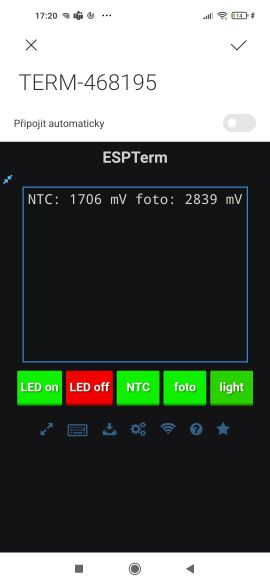
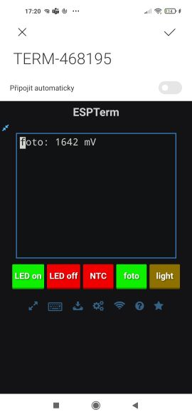
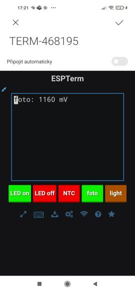
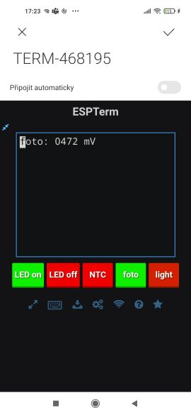

# Poznámky z pøedmìtu LPE
Usmoleno **Vojtìchem Michalem** (vojta.michall@email.cz) v prùbìhu letního semestru 2021 (B202).  
Oficiální materiály jsou na Moodle na stránce https://moodle.fel.cvut.cz/course/view.php?id=5814
a na Embedded serveru https://embedded.fel.cvut.cz/kurzy/lpe/LPE2021.  
Seznam souèástek s pinout a schematickımi znaèkami: https://moodle.fel.cvut.cz/pluginfile.php/293919/mod_resource/content/3/Soucastky_vyvody_LPE_4.pdf

Tıdny jsou èíslovány chronologicky, poznámky k nim jsou uvedeny v obráceném poøadí.
Jako první je tedy uveden poslední tıden, scrollováním na konec stránky se èlovìk dostane na tıden první.

## Tıdny 7+8 - WiFi a hezèí formátování vıstupu
Instrukce pro tento tıden jsou na https://moodle.fel.cvut.cz/pluginfile.php/283748/mod_resource/content/7/LPE_7_tyden_poznamky_v6.pdf

**Fotodioda** - zapojuje se v závìrném smìru, pøi dopadu záøení na PN pøechod prochází fotoproud úmìrnı intenzitì záøení.
V propustném smìru více ménì normální dioda. Pouívá se tak tøetí kvadrant její VA charakteristiky.  
**Fototranzistor** - NPN, kde pøechod báze -> emitor je zprostøedkován fotodiodou. Dopadem svìtla vzniká fotoproud,
ten je rovnou zesílen zbytkem tranzistoru. Ménì lineární ne fotodioda, nevhodnı na mìøení, spíše na bistavové 
rozhodování on/off (tøeba optické závory).

> 7.1 Pøipojte k MCU fototranzistor a NTC termistor (dle obr.7.1). Pomocí funkce zobrazení grafu v reimu voltmetru
otestujte funkènost senzorù. Pomocí generátoru PWM a osciloskopu otestujte rychlost (odezvu na skok) fototranzistoru.
Napište program, kterı bude èíst data z obou senzorù (20x za sekundu, èasování èítaèem), posílat je do PC a zobrazovat
pomocí Data Plotteru (vyuijte program z minulého tıdne).

a) Data plotter není moc vhodnı pro vyhodnocení dynamiky fototranzistoru. Na nìj tedy pouiji staré dobré LEO.
Optická závora zapojena podle schématu, kanály osciloskopu pøipojeny na kolektor Q2 (kanál 1) a emitor Q1 (kanál 2).
Hoooooodnì od oka: Signál z fototranzistoru má 2.4V peak2peak, take amplitudu 1.2V. Zkusme najít (experimentálnì)
jeho bandwidth (na nìm bude mít amplituda velikost jen 0.707 pùvodní velikosti). Hledám tedy frekvenci, na které dosáhne
maximum signálu na kanálu 2 hodnoty `1.2V (DC offset) + 0.7*1.2 = 2.04 V`.  
To nastane pøiblinì na frekvenci 2.4kHz, take by bylo asi mono hovoøit o šíøce pásma cca 2500 Hz.
Následují obrázky zachycují mìøené prùbìhy kanálù 1 a 2 osciloskopu pro frekvence 
  - 500 Hz ... fototranzistor v pohodì stíhá
  - 1000 Hz ... fototranzistor je dost na hranì
  - 2400 Hz ... u asi pøíliš rychlé

Frekvence je vdy v levém horním rohu obrázku.

b) Pro vytvoøení programu staèilo vzít základní program z minulého tıdne a provést pár úprav.
  - Pøidat vlastní `Ticker` pro obslouení analogovıch mìøení
  - Pøidat funkci volanou z interruptu daného Tickeru

Zdrojovı kód je v repozitáøi ve sloce `${root}/code/week7/main.cpp`,
rovnì na mbedu projekt `LPE_dataplotter.`

Ovìøení, e data pøichází pøesnì na 20 hertzích (èasová základna je nastavena tak, aby celı rozsah obrazovky 
dával právì jednu sekundu. Na obrazovce je viditìlnıch 20 pøíchozích vzorkù):

Ve vıstupu DataPlotteru je èervenı kanál signál z fototranzistoru, modrı kanál je signál z NTC.
Mìøení teploty má pøirozenì vıraznì delší èasové konstaty (srovnej s úkolem 4.9 - regulátor teploty, kde se èasová 
konstanta NTC mìøila v desítkách sekund, zatímco fototranzistor má desetiny milisekund. To je 5 øádù rozdíl).
Pøesto je i na signálu NTC patrnı pomalı pokles, protoe jej zahøívám pøiloenımi prsty. Signál z fototranzistoru
odpovídá støídavému zakrıvání rukou (minima) a rozvìcení (maxima, tehdy je fototranzistor saturován s Uce cca 100mV).

Senzory prohlašuji za funkèní. 

> 7.2 Zprovoznìte vıvojovı modul s ESP8266 – pøipojte ho pøes USB k PC (nainstalujte pøípadné ovladaèe pro virtuální
sériovı port – èip CH340G), pøipojte se na tento port libovolnım terminálovım programem (Hyperterminál, RealTerm
nebo Putty). Pøipojte se na WiFi Access Point, kterı modul po zapnutí vytváøí (jméno nìco jako: „TERM-15F130“), ve
webovském prohlíeèi se Vám otevøe www stránka (je to pøípadnì adresa 192.168.4.1 – esp-terminal.ap) s terminálem.
Ovìøte pøenos textu (ASCII znakù) obìma smìry – z www terminálu do konzole pøipojené na virtuální sériovı port i
naopak. V nastavení nezvyšujte vysílací vıkon, abyste zbyteènì nerušili okolní WiFi sítì.
V bodì 7.2 je WiFi modul pøipojen pouze k PC pøes USB-micro kabel.

Modul se po pøipojení napájení chová jako access point, ádné další nastavení není potøeba. Stránka s `ESPTerm`em
se otevírá automaticky po pøipojení, pøípadnì pouít IP adresu v zadání. Zaøízení se souèasnì pøipojuje jako COM port,
v mém pøípadì COM9, pøes kterı je moné vytvoøit tok dat 
ve smìru `webová aplikace ESPTerm -> wifi -> ESP modul -> seriová linka -> terminál v PC` i opaèném.

Pøenos jedné vìty je vidìt na následujícím obrázku. Na levém monitoru je webové rozhraní, na pravém monitoru
jsou spodní dva terminály vázány na COM port 9. Pøenos funguje obìma smìry na nastaveném baudrate 115200 bps.

> 7.3 Pøipojte WiFi modul s ESP8266 k procesoru STM32F042 a tento v mbedu naprogramujte tak, aby vysílal po sériové
lince data namìøená ze dvou senzorù a zároveò pøijímal pøíkazy zadané v ESPTermu. Data zobrazujte v ESPTermu a
demonstrujte, e reagují na podnìty (napøíklad fototranzistor snímající okolní osvìtlení, zapnutí - vypnutí LED
nasmìrované na fototranzistor). LED diodu pøipojenou k mikrokontroléru na nepájivém poli ovládejte pomocí tlaèítek On
a Off, která si takto pøejmenujete v ESPTerminálu.
V rámci bodu 7.3 pøipojte WiFi modul k Vašemu nepájivému poli pomocí 4 dodanıch kablíkù - napájení 5V, RXD, TXD
a GND. USB-micro kabel ji do WiFi modulu nepøipojujte. Viz Obr. 7.2. Je zbyteèné WiFi modul zasouvat do nepájivého
pole, které se tak zbyteènì nièí - nevratnì se roztahují kontakty, zvyšuje se odpor propojení.

> 7.4 Vytvoøte program, kterım budete demonstrovat pouití „ESCAPE“ sekvencí pro práci s ESPTerminálem – mìòte
barvu tlaèítka v ESPTermu podle toho, jestli na fototranzistor dopadá svìtlo z LED nebo ne (dopadá = zelená, nedopadá -
èerná). Úkol 7.4 lze snadno odevzdat jakou souèást úkolu 7.3. Stejné zapojení jako v bodì 7.3.

Zdrojovı kód je v mbedu pro úsporu èasu ve sloce `${root}/code/week7/LPE_wifi.cpp`. Základní prostøedí nakonec vypadá takto:

Tlaèítka 1 a 2 (èíslováno zleva) mají stabilní barvu a ovládají LEDku on/off. 
Tlaèítka 3 a 4 zapínají a vypínají pøenášení dat z NTC a z fototranzistoru. 
Jejich barva je zelená èi èervená podle aktuálního stavu - èervená vypnuto, zelená zapnuto.  
Tlaèítko 5 je pouze pro zobrazování, jeho barva se spojitì mìní mezi èervenou a zelenou
pro idikaci míry osvìtlení fototranzistoru.

Mìøení probíhá na rezistoru pod fototranzistorem, napìtí je proto rostoucí funkcí intenzity osvìltení.
Barva se vybírá lineární interpolací
  - pro napìtí 0mV je hex kód barvy 0xff'00'00 (sytì èervená)
  - pro napìtí 3300mV je hex kód barvy 0x00'ff'00 (sytì zelená)
  - pro napìtí U se vypoète zelená sloka jako `(int)(sense2 / 3300.0 * 0xff)`, èervená je doplnìk do 256.

Pozor, e nibbly jednotlivıch barevnıch sloek jsou prohozené. Escape sequence `"\e]30;4;#f00f00\n\e\\"`
zapíše do modré sloky `0x0`, zelené sloky `0xf0` a èervené sloky `0x0f`.

**Demonstrace spojitého spektra barev indikátoru osvìtlení**: S klesající intenzitou osvìtlení se indikátor 
pøesouvá ze zelené pøes hnìdou na èervenou.

## Tıden 6 - UART a audio aplikace
Instrukce pro tento tıden jsou na https://moodle.fel.cvut.cz/pluginfile.php/283744/mod_resource/content/4/LPE_6_tyden_poznamky_2021_v3.pdf

Tøídy zesilovaèù:
  - Tøída A - jeden tranzistor jako lineární zesilovaè. Na nìm je stále velkı ztrátovı vıkon, ale zesílení je kvalitní,
  nejsou tam nìjaká pøechodová zkreslení.
  - Tøíba B - Dva tranzistory trošku pøedotevøené stejnosmìrnım pracovním bodem; ménì to topí, nic neteèe, kdy není nic na vstupu.
  Vyvstávají drobná zkreslení, kdy se zavírá jeden a otevírá druhı.
  - Tøída D - signál se porovnává komparátorem s trojúhelníkem konstantní (vıraznì vyšší) frekvence. Tím vzniká odbélníková PWMka,
    která øídí spínací n/p MOSFETy v protifázi. Na nich jsou v ideálním pøípadì nulové ztrátové vıkony, protoe je vdy jeden plnì 
    otevøen a druhı plnì zavøen. Obecnì horší EMC, protoe je potøebné rychlé spínání, jen je potøeba dobøe blokovat a zváit
    i pøi návrhu desky. Nelze stoupat vıkonem do nekoneèna
Typickı use case je zesilování audia, obecnì frekvence od 20 Hz do 20kHz. Samozøejmì i jiná pouití, ale audiosignály jsou typickı
zástupce této oblasti frekvencí. 

Zapojení pro tento tıden:

> 6.1 Sestavte zesilovaè pro reproduktor s obvodem LM386 a tranzistorovı zesilovaè pro mikrofon

Pro generovanou PWM je impedance C8 paralelnì k C3, R3, RV1. Kdy C8 odstraníme, amplituda generovaného "støídavého" signálu
vıraznì povyroste. Vazby mezi mikrofonem a reproduktorem je pak velmi silná na celou vzdálenost, kterou mechanicky pøipouští vodièe.
LM386 má bandwidth >> 20kHz, take je náchylnı na VF šumy. Záleí proto na délkách vodièù (ádné dlouhé antény) i layoutu.
C4 je oddìluje stejnosmìrnì reproduktor od vıstupu zesilovaèe. DC je neádoucí - tepelné ztráty ohøívají reproduktor a pøitom negenerují zvuk.

Dva zmìøené prùbìhy jsou na obrázcích. Modrı kanál je vstupní PWM, èervenı kanál je napìtí na kolektoru Q1.  
Na prvním obrázku jsou mikrofon a reproduktor skoro na dotek; fázovı posun je minimální a mikrofon je saturován signálem.

Na druhém obrázku jsou mikrofon a reproduktor cca 5cm od sebe; fázovı posun roste a amplituda na kolektoru tranzistoru slábne.

##### Ovìøení pomocí aplikace Spectrodroid
Asi není ádnım pøekvapením, e obvod generuje pøesnì zadanı tón a e generuje liché harmonické,
protoe právì ty jsou obsaeny v obdélníkovém signálu. Spektrum zvuku pøi nastavení generátoru na 1kHz square:

Ve zvuku nejsou ádné relikty na niší frekvenci (nyní je generátor nastaven na 3kHz sinus,
proto nejsou pøítomné ani vyšší harmonické, ale to nelze ukázat kvùli nastavení rozsahu aplikace).

> 6.2 Zmìøte rychlost zvuku

Na frekvenci 5kHz se posunul vstupní a vıstupní signál o jednu periodu ve vzdálenosti 7 cm.
Platí `s = v*t`, odtud `v = s/t`. Vzdálenost s mìøím pravítkem a èas t je perioda signálu @ 5kHz, 
tedy `t = T = 1/f = 0.2 ms`. Mìlo by platit `v = 350 m/s`. Typická hodnota v suchém vzduchu pøi 20°C 
je 343 m/s. Z mìøení vyšla zdánlivì pøesná hodnota, ale na pozadí je obrovská nejistota, protoe aèkoli
èas lze odeèíst pomìrnì pøesnì díky osciloskopu, vzdálenost mikrofonu a reproduktoru je odeètena s obrovskou
nesistotou klidnì +/- 1 cm (obì souèástky je potøeba dret v optimální orientaci a èlovìk má málo rukou).
S jistotou tak mùeme hovoøit o dobré shodì v øádu stovek, na øád desítek bych se ale nespoléhal.

Zamlèené pøedpoklady mìøení: elektrickı signál se šíøí vıraznì rychleji ne zvuk ve vzduchu. Díky tomu je moné
do jisté míry zanedbat dopravní zpodìní zpùsobená prùchodem signálu zesilovaèi a vodièi. Další (pro 
jednu frekvenci konstatní) fázové zpodìní (pozorovatelné na prvním prùbìhu)
zpùsobují RC filtry zapojené na obou stranách obvodu. 

> 6.3 Pøipojte k mikrokontroléru pøevodník USB-serial,

V návodu je popsáno pøipojení UART pøevodníku atp. Základní poznatky
  - pozor na logickou úroveò - Pøevodník mùe umìt i 5V logiku, co by moho spálit 5V netolerující pin. TX line je **v klidu** drena ve **vysoké úrovni**!
  - UART je **push pull**, take pouze single-ended komunikace. Open drain UART lze emulovat softwarovì.
  - Frame = 1 start bit + n bitù lsb first + konfigurovatelnı poèet stop bitù

Zachycenı a dekódovanı frame pøi odesílání pøíkazu 's' (ascii hdonota 0x73) z poèítaèe do MCU. Bajty odešly dva, protoe terminál není v raw reimu,
pro potvrzení bylo potøeba stisknout enter, kterı byl odeslán jako line feed (TODO kouknout, jestli by odesílání z windows poslalo celé CRLF):

Zachycená odpovìï

Pozn: protoe je stopbit stejné polarity jako je klidovı stav na vodièích, není moné na první pohled identifikovat konec rámce. Je potøeba napoèítat si
bity od zaèátku rámce, kterı je vdy odlišitelnı nízkou úrovní. Proto není obecnì nezbytné mít obì zaøízení nastavená na stejnı poèet stopbitù,
paklie se nám podaøí garantovat dostatek èasu mezi dvìma rámci (kadı okamik, kdy je lajna v klidu, lez poèítat jako další stop bit).

jiné vyuití UARTu je s programem Dataplotter. Na obrázku jsou vykresleny èasovı prùbìh napìtí na ochranném rezisotru u èervené LED a vıstup
detektoru špièek (test point 1) za kolekterm zesilovaèe Q1 z prvního zapojení. Nejprve jsou oba signály v klidu, následnì dojde k softwarovému
vypnutí LED (spádná hrana na modrém kanálu) a hlasitému ukání o stùl (peaky na èerveném kanále).

Prùbìh peak detektoru obsahuje stejnosmìrné posunutí. Jej se lze bavit umístìním kondenzátoru C5 mezi kolektor Q1 a anodu D1.

> 6.4 Porovnejte spektrum generovaného zvuku 

Pøepojení PWM vstupu z nuclea na pin PB1 na F042, na nìm lze generovat 16kHz PWMku s promìnlivou støídou tak, e
po vyhlazení vzniká skoro 2kHz sinus. Protoe je na periodu pouze osm vzorkù, obsahuje spektrum
i vyšší harmonické, nikoli pouze èistı 2kHz signál.

## Tıdek 5 - Pokroèilejší operaèní zesilovaèe
Instrukce pro tento tıden jsou na https://moodle.fel.cvut.cz/pluginfile.php/295565/mod_resource/content/2/LPE_5_tyden_poznamky_2021_partII_v2.pdf

#### Úkol 4.6
> Zapojte OZ jako komparátor bez a s hysterezí

Komparátor U1A musí saturovat na napájení èi na zem, proto nemá ádnou nebo jen kladnou zpìtnou vazbu 
(vıstup je pøiveden na neinvertující vstupní svorku).
Hysterezi zajišuje rezistor R1 pøipojenı mezi neinvertující svorku a vıstup U1A. Dále je k neinv. svorce
pøipojen vıstup sledovaèe U1B udrujícího konstantní úrovìò nastavenou trimmerem RV1. Na invertující svorce je pøipojen 
kondenzátor C1 z RC èlánku vyhlazujícího obdélníky generované PWMkou na exponenciálu.  
**Schéma:**

"Síla" hystereze (jak daleko jsou od sebe pøeklápìcí úrovnì) bude závislá na hodnotì rezistorù R1, R2 kolem komparátoru. 
Paklie oznaèím vıstup U1A jako Uo, napìtí na vıstupu sledovaèe Uref a rozhodovací úroveò hystereze jako UH,
pomocí uzlovıch napìtí lze odvodit vztah

.

Pro získání obou úrovní UH+ a UH- je potøeba dosadit Uo = 3V3 a Uo = 0V. Speciální pøípady:
  - pro R1 = nekoneèno (ádná zpìtná vazba) se druhı sèítanec redukuje na 0 a platí UH = Uref.
  komparátor se pøeklápí bez jakékoli hystereze
  - pro R1 = 0 (jednotková ZV) je zlomek roven jednièce, referenèní napìtí se odeète a zbıvá UH = Uo
  vzdálenost rozhodovacích úrovní je celı rozsah napájení (3V3).
  - pro R1 = R2 ("polovièní" ZV) je zlomek roven 1/2 a rozhodovací úrovnì jsou v polovinì vzdálenosti Uref
  a Uo; vzdálenost rozhodovacích úrovní je 50% rozsahu napájení (3V3).
  - **Obecnì:** Po úpravách lze odvodit (pomìrnì oèekávatelnı) vısledek,
  e "šíøka" hystereze je pøímo úmìrná dìlicímu pomìru dìlièe R1, R2. Viz následující rovnice

**Pár namìøenıch prùbìhù:** 
Kanály osciloskopu:
  - CH1 = vıstup komparátoru (label `OSC1`)
  - CH2 = pøeklápìcí úroveò (label `OSC2b`)
  - CH3 = pøechodovı dìj na C1 (není zakresleno ve schematu)

a) Silná hystereze (R1 = 10k),vıstup trimmeru Uref = 1.667V.  
Podle pøedchozího odvození bych oèekával rozhodovací úrovnì 
UH = `1.667 +/- (3.3-1.667) * 10k/(10k+10k) = 1.667 +/- 0.8165` = 2.4835V a 0.85V
(na obrázku jsou rozhodovací úrovnì zmìøeny pomocí horizontálních kurzorù).

b) ádná hystereze (R1 = inf), vıstup trimmeru 1.815V:

**Vliv rozhodovacích úrovní na støídu obdélníku**

Na následujících prùbìhách lze pozorovat, jak nastavení rozhodovací úrovnì trimmerem ovlivní støídu generovaného obdélníku.
Nízká rozhodovací úroveò znamená, e napìtí kondenzátoru bude vìtšinu doby nad rozhodovacími úrovnìmi a vıstup tak bude vìtšinu u doby na zemi.
Naopak vyšší rozhodovací úroveò povede na vyšší støídu (relativnì delší dobu, kdy je vıstup U1A na napájení).
Pro pøíliš vysoké/nízké rozhodovací úrovnì se nebude komparátor pøeklápìt vùbec a na vıstupu bude stále vysoká èi nízká úroveò.

a) Slabá hystereze (R1 = 120k), vıstup trimmeru 2.749V:

b) Slabá hystereze (R1 = 120k), vıstup trimmeru 1.093V:

**Odolnost proti rušení**
Hystereze komparátoru je nezbytná v aplikacích, kde je na vstupní signál superponované vysokofrekvenèní rušení.
Jeho vlivem by se mohl komparátor pøeklápìt èastìji, ne je skuteènì ádoucí. Pøidáním hystereze vzniká urèitı
pás uprostøed napìového rozsahu, kde komparátor nereaguje a èeká a na dosaení definované úrovnì.
Pro kvalitní potlaèení šumu bychom si pøáli maximální hysterezi. Silnìjší hystereze ale s sebou nese inherentní problém,
e by mohla potlaèit i vlastní vstupní signál, kterı si pøejeme detekovat (ilustrováno níe).

K PWM z minulıch experimentù je na následujícím obrázku pøidána další PWM na frekvenci asi sedmkrát vyšší.
Spojeny jsou pøes rezistory rùzné velikosti (rychlejší PWM simulující šum proto má niší amplitudu). 

Na následujících prùbìhách je ilustrována špatná rozhodovací úroveò a poté úroveò "na hranì" pøípustnosti.
Jednou se komparátor vùbec podle vstupního signálu nepøeklápí, jindy se pøeklápí jen v èásti pøípadù a není tak spolehlivı.

#### Úkol 4.7
> Zapojte OZ jako generátor obdélníkového signálu (Astabilní Klopnı Obvod)

Schéma je na obrázku. Prakticky je to stejnı komparátor jako v úloze vıše, jen se místo externí PWMky nechá
kondenzátor pøebíjet pøímo z vıstupu U1A. Pro snazší nastavování referenèní úrovnì pomocí trimmeru RV1 jsem
zapojil nevyuitı OZ jako napìovı sledovaè U1B.

**Pozn.** Bez hystereze (R1 = inf) se v obvodu dìje kdoví jaká špatnost.
Na následujícím obrázku je jakısi signál z vıstupu OZ, nejspíše je ale stále podvzorkovanı.
Rozhodnì taková rychlá smyèka nebude zdravá ani pro OZ, ani pro EMC.

Na referenèním napìtí nastavovaném trimmerem je závislá frekvence i støída generovaného obdélníku, jak
se lze pøesvìdèit z následujících prùbìhù. Malá hystereze (R1 = 120k) a rùzné polohy trimmeru:  
a) Trimmer Uref = 57mV:

b) Trimmer Uref = 683mV:

c) Trimmer Uref = 1659mV:

d) Trimmer Uref = 3106mV:

Korektnìjší je øíci, e na poloze trimmeru závisí doby T1 (napìtí na kondenzátoru stoupá) a T2, kdy se kondík vybíjí.
Bìhem tìchto dob se napìtí po exponenciále pøesouvá mezi jednou a druhou pøeklápìcí úrovní. Z jejich pomìru a pøevrácené
hodnoty souètu lze potom vypoèíst frekvenci a støídu generovaného obdélníka.  
**Odvození**

Dává tento vısledek smysl? Protoe u(t) je vdy mezi u0 a uinf, musí bıt zlomek menší jak 1,
proto bude logaritmus zápornı a dohromady bude t kladné (co potøebujeme. Z povahy problému je triviálnì vidìt,
e T1 i T2 musí bıt nezáporné. Dokonce musí bıt i kladné kvùli spojitosti napìtí na kondenzátoru a nenulové hysterezi).
Odtud dále

Podaøilo se vyjádøit èasy T1 a T2 jako funkce referenèního napìtí na trimmeru. Sílu hystereze nastavovanou rezistorem R1
neberu jako promìnnou, poèítám jen s hodnotou 120k, pro kterou jsem si namìøil data. Stìejní otázka: Dává to furt smysl?
Logaritmy musí bıt záporné. U T2 to je vidìt triviálnì (ve jmenovateli je nìco kladného navíc, co není v èitateli).
Pro T1 to není tak zøejmé. Protoe však 12/13 3V3 > 12/13 Uref, bude èitatel i jmenovatel zlomku zápornı,
jmenovatel bude vìtší v absolutní hodnotì. Take asi OK.

Èasová konstanta dìje je `tau = 12 ms`. Dosazením do rovnice (2) získáme
  - pro Uref = 1.659V ... `T1 = 1.859 ms`, `T2 = 1.840 ms`, `f = 270 Hz`
  - pro Uref = 0.683V ... `T1 = 1.199 ms`, `T2 = 4.060 ms`, `f = 190 Hz`
  - pro Uref = 0.057V ... `T1 = 0.976 ms`, `T2 = 21.15 ms`, `f = 45 Hz`

Pro Uref = 1659 mV jsme pøiblinì uprostøed rozsahu napájení, take by mìla vyjít støída 50%.
Frekvence nejsou úplnì stejné jako ty mìøené osciloskopem (302, 205 a 47 hertzù).
Moné chyby mohl do vıpoètu vnést fakt, e OZ není dokonale rail to rail. Další chyby pøirozenì vnáší
nejistoty hodnot souèástek, kvantizaèní chyba pøi mìøení napìtí atd.  
Všeobecnì ale vısledky nejsou v rozporu s realitou, vıpoèet souhlasí.

#### Úkol 4.8
> pøevodník obdélníkového signálu na trojúhelníkovı (integrátor)

Druhı OZ U1B akorát pøedìláme z napìového sledovaèe na integrátor, kterı se pøipojí na vıstup AKO.
Pøipojení dalšího tvarovaèe s diodami na vıstup U1B by umonilo generovat sinusovı signál (starší metody
analogového generování funkcí. Dnes èasto vytlaèovány digitálním øízením a DAC).

Zajímavá je posunutá nula pro U1B pomocí kombinace rezistorù R5, R6.

Generované signály jsou na následujícím prùbìhu (vıznam kanálù osciloskopu je podle schématu):
  - CH1 = vıstup U1A (obdélník)
  - CH2 = vıstup U1B (trojúhelník)
  - CH3 = C1 (pøechodovı jev na RC èlánku)

#### Úkol 4.9
> Sestavte zapojení s OZ – regulátory teploty

Na schématu jsou dvì alternativy
  - Neosazenı R4a => U1B má jen zápornou zpìtnou vazbu a chová se lineárnì.
  - Neosazenı R4b => U1B má jen kladnou zpìtnou vazbu a je to on/off spínaè.

Na vıstup OZ je pøipojena LED indikující "spuštìní topení" (v pøípadì lineárního módu ukazuje aktuální intenzitu topení).
Dále je vıstupem OZ øízena báze NPN tranzistoru Q1, která reguluje proud tekoucí skrz R1. Joulovo teplo na nìm spálené
ohøívá NTC (rostoucí teplota ... klesající odpor) TH1, kterı uzavírá zápornou zpìtnou vazbu kolem celého obvodu.
Dvojice souèástek R3, RV1 nastavuje posunutou nulu pro U1B, kolem této úrovnì kolísá i napìtí na dìlièi R2,TH1.
S rostoucí teplotou TH1 klesá jeho odpor, take klesá i vıstup dìlièe. V dùsledku toho poklesá napìtí na neinvertující
svorce. Kdy poklesne pod úroveò invertující svorky, OZ vypne topení a TH1 se chladí.
.

Stejnou zpìtnou vazbu by šlo uzavøít, kdybychom TH1 pøipojili do odporového dìlièe "nahoru" a otoèili svorky operáku.
Klesající odpor TH1 by zvyšoval celkové napìtí na vıstupu dìlièe, tím by rostlo napìtí na inv. svorce
a tím by operaèní zesilovaè brzdil topení.

Špièkovı topicí proud byl 127 mA z 5V pøes R1=33ohm a Q1, to odpovídá vıkonu cca pùl wattu.
(To mimochodem pøi napìtí 3v3 na vıstupu U1B odpovídá proudu 1.35 mA do báze Q1. Ten by tak mìl èinitel
h21e tìsnì pod stovku, co je oèekávaná hodnota pro vıkonovı BJT. V pøedchozích úlohách se pouíval signálovı BJT
se zesílením cca 400).

**Identifikace systému:** Proces skokového ohøátí NTC z odporu 11 442 ohm (cca 22°C) na ustálenıch 4316 ohm (cca 45°C) trval 214 sekund.
Pøedpokládejme, e se jedná o systém prvního øádu. Zmìøenı èas 214 s je pìtinásobek èasové konstanty, take by mohlo platit
cca `tau ~ 43 s`.  
To asi není úplnì nereálné, ale model má jistì nezanedbatenou chybu, protoe systém se není schopen ohøívat
libovolnì rychle (Q1 omezuje ohøívací proud tekoucí pøes R1). Proto je velikost derivace teploty na TH1 omezená
a ohøívání by bylo potøeba modelovat systémem øádu vyššího.

## Tıden 4 - Operaèní zesilovaèe
Instrukce pro tento tıden jsou na https://moodle.fel.cvut.cz/pluginfile.php/283742/mod_resource/content/4/LPE_4_tyden_poznamky_2021_v3.pdf

Vırobní technologií lze operáky rozdìlit na bipolární (napø OPA227) a unipolární - dále dìleny podle JFETù/CMOSù na vstupu
  - Bipolární  - nízkı napìovı šum pøi zkratu vstupù (CMOS tøeba 8uV peak/peak, OPA227 zvládne tøeba 90nVp-p .. 2 øády rozdíl) 
     Vstupní proud v klidu (input bias current) v øádu tøeba 2.5 nA (OPA227).
  - Unipolární: Fantastickı klidovı vstupní proud +/-1 pikoampér pro CMOS, JFETy tøeba femtoampéry.
    - JFETy - nízkı proudovı šum
    - CMOSy (tøeba MCP6002) - Fungují i pro nízká napìtí (i tøeba 1.8V), vhodné tøeba k MCU (tam u máem zdroj 3V3).

V pøípadì MCP6002 je zmìøitelná "body dioda" ve smìru Vss->VDD. Pøi pøepólování napájení se otevøe a bude to "hoøet".

Ideální **open-loop gain** je nekoneèno, reálnì 88-112 dB (pro MCP6003). OPA227 tøeba 160 dB (108 krát)

Charakteristika **Gain-bandwidth product** (= souèin open-loop gain a šíøky pásma (bandwidth)), odráí frekvenènì závislé vlastnosti operáku.
Na frekvenci `bandwidth` je jednotkové zesílení. Pøi stejnosmìrném vstupním napìtí je zesílení `open-loop gain` (viz ARI str 49). Kdy jsme nìkde
mezi, poklesá s rostoucí frekvencí zesílení, kterého umí operák dosáhnout (rychlé hrany vyadují rychlé pøebìhy a OZ má koneènı slew rate).
`Gain-bandwidth product` tak omezuje souèin frekvence a zesílení na konstantní hodnotu.

#### Úkol 4.1
> Zapojte OZ jako sledovaè napìtí (impedanèní oddìlovaè), na vstupu napìtí na LED (ILED=5-20mA), zmìøte vıstupní
odpor tohoto zapojení pro IOUT = 0 a 4 mA (zatíení OZ)

Ideální vlastnosti sledovaèe: Rin = nekoneèno, Rout= 0.
Reálnì má vıstupní stupeò operáku nenulovı vnitøní odpor,
pro vyšší proudy zaène vıstupní napìtí OZ poklesat kvùli úbytku. "Vnitøní odpor" mùe bıt pro MCP6002 øádovì 100 ohm.

Na grafu od Ing. Petruchy je osa x vıstupní proud v mA, osa y je referenèní napìtí ve voltech.

Mìøím v bodì Voltmetr1 (vıstup operáku) pøi zátìích 0mA a pøiblinì 4mA.
Zmìøená napìtí: bez zatíení 1811.97mV, pøi zátìi 4.17mA napìtí 1815.13mV. Z toho lze vypoèíst
vıstupní odpor pro nízké proudy Rout = 0.76 ohm. 
Srovnej s vlastnostmi, které bychom dostali odebíráním proudu pøímo z napìového dìlièe napø z rezistorù 10k. Odbìr 4mA by
na horním rezistoru v dìlièi zpùsobil úbytek 4V. V pøípadì velkıch dìlièù (tøeba mìøení 600V na tractive system dìlièem 68k : 1M)
impedanèní oddìlení nezbytné.

Pozn: Napìovı sledovaè je zpìtnovazební soustava, která v principu nemusí bıt vùbec stabilní.
U nìkterıch zesilovaèù se toto explicitnì uvádí jako **unity gain stability**. Pokud vzniklé zapojení není stabilní,
OZ bude mít tendenci oscilovat. Dùsledkem potom je, e multimetr mìøící RMS tøeba bude zdánlivì mìøit rozumná èísla,
ale osciloskop ukáe rychlé smyèky. Toté se mùe stát napøíklad u low drop-out regulátorù.

Nevyuitım operákùm je potøeba definovat úroveò vstupù, napøíklad zapojením sledovaèe zemì:

#### Úkol 4.2
> Sestavte neinvertující zesilovaè napìtí 11x a zmìøte pomocí nìj saturaèní napìtí NPN tranzistoru.

Zapojení je na obrázku, odpor Rb bude nabıvat vícero hodnot pro dosaení rùzného stupnì saturace.

Napìtí na kolektoru NPN tranzistoru je pøímo rovné napìtí U+ na neinvertující svorce OZ.
Napìtí Uo je na vıstupu operaèního zesilovaèe (bod *Voltmetr1*).

a) Zmìøená napìtí pro bázovı odpor 10k: U+ = 33 mV, Uo = 363 mV.
Dává vısledek smysl? OZ je zapojen s dìlièem 1k a 10k, jeho zesílení je `A = 1 + 10/1 = 11`.
Na vıstupu OZ tak oèekávám 33mV * 11 = 363 mV, co se rovná zmìøenému napìtí.
Sešla se nízká zátì vıstupu OZ `< 0.3 mA` a zøejmì velmi dobré hodnoty rezistorù v dìlièi.

b) Zmìøená napìtí pro 5k v bázi: Saturace NPN naroste, oèekávám niší saturaèní napìtí ve smìru kolektor->emitor.  
Zmìøeno U+ = 24 mV, Uo = 252 mV.  
Mìøení je v poøádku. ADC mìøí kvùli kvantizaèní chybì (ideálnì) +/- 0.5 LSB, další chybu mùe vnést numerická chyba pøepoètu
LSB -> mV v mikrokontroleru (náchylné na ztrátu pøenosti floatovıch operací, nebo na oøezávání v celoèíselném dìlení).
Paklie by skuteèné napìtí Ucebylo tøeba 23mV, poté mìøenı vıstup OZ sedí pøesnì.
c) Zmìøená napìtí pro 470 ohmù v bázi: U+ = 14 mV, Uo = 150 mV.
Závìry jsou stejné jako v podúloze (b).

Praktickı vıznam neinvertujícícho zapojení OZ je kvùli pøesnìjšímu digitálnímu mìøení. Digitální multimetr má nejistotu mìøení
závislou na aktuálním mìøicím rozsahu. Paklie by nejniší rozsah byl tøeba 200 mV a nejistota tøeba 0.5% rozsahu,
vnášelo by to implicitnì chybu vnìøení 1 mV. Kdybychom pak chtìli mìøit napìtí tøeba 10 mV, rovnou máme 10% relativní chybu.
Pouitím zesilovaèe se zvıší mìøená hodnota a tím poklesne vliv chyby z rozsahu.

Jinımi slovy OZ zesiluje "analogovì" (díky ZV zapojení mùeme dokonce pøedpkládat, e zesiluje velice dokonale).
Kdy jej pøedøadíme zaøízení vnášejícímu kvantizaèní chybu, poté se relativní chyba kvantování sníí, protoe optimálnì
vyuíváme celı rozsah na mìøení signálu po zesílení (viz protokol 2 ze SME: vliv nesrpávného vertikálního mìøítka osciloskopu 
na vypoètené RMS).

#### Úkol 4.4
> Zmìøte vstupní napìovı offset pouitého operaèního zesilovaèe (MCP6002).

Schéma zapojení:

Mìøení s pouitím R4 = 120k nedávalo ádné mìøitelné vısledky.
Pro R4 = 1 megaohm (zesílení operáku `A = 1+1'000'000/470 = 2128`) namìøeno:
  - Uo = 1.4 mV pro OZ pod piny 1,2,3
  - Uo = 5.6 mV pro OZ pod piny 5,6,7

S ohledem na zesílení to odpovídá vstupním offsetùm 0.66uV pro OZ na pinech 1,2,3 a 2.63uV pro OZ na pinech 5,6,7.
Datasheet garantuje maximální offset 4.5 mV, take namìøené offsety jsou velice velice velice dobré
(a v rámci paralelky na cvika asi celkem vıjimeèné).

#### Úkol 4.3
> Sestavte zapojení I/U pøevodníku s OZ a pouijte jej pro zpracování signálu z fotodiody (náhrada èirou LED). Na
fotodiodu blikejte pomocí LED (frekvence 1 Hz a 1 kHz, støída 2-50 %). Uspoøádejte dané prvky jako reflexní senzor.

Zapojení na obrázku:

*generátor* generuje obdélníkovı signál, kterım se spíná zelená vysílací LED v kolektoru NPN tranzistoru.
Ta je optickou vazbou spojena s pøijímající èervenou LED, kterou kvùli dopadajícímu svìtlu teèe proud v závìrném smìru. 
Prvním operaèním zesilovaèem je proud pøeveden na napìtí; to je zesíleno druhım operákem 
(s pouitím R2 = 188k, R4 = 10k je zesílení `A = 1+188/10 ~ 20`) a mìøeno kanálem 2 osciloskopu.
Kanál 1 osciloskopu mìøí napìtí v kolektoru tranzistoru, proto je vysílací LED aktivní pøi pøizemnìní signálu.

S promìnlivou støídou jsou prùbìhy více ménì stejné, modrı kanál (pøijímanı signál) se ustálí na hodnotì ~3V.
Dosaená úroveò je závislá na síle optické vazby (napø. poloha a natoèení LEDek).

## Tıden 3 - Tranzistory
Instrukce pro tento tıden jsou na https://moodle.fel.cvut.cz/pluginfile.php/283739/mod_resource/content/4/LPE_3_tyden_poznamky_2021_v4.pdf

#### Úkol 3.1
> Zmìøit proudovı zesilovací èinitel NPN tranzistoru h21E

Základní zapojení se spoleènım emitorem.
Na bázi je zapojen 1 megaohm proti 3V3, úbytek na nìm zmìøen jako 2.660 V (na PN pøechod B->E zbıvá 636 mV).
V kolektoru je èervená LED a rezistor 470R s serii proti 3V3, na Rk úbytek 528 mV.

Z toho plyne proud bází Ib` = 2'660/1'000'000 = 2.6 uA` a proud kolektorem Ic` = 528/470 = 1.12 mA`
a zesilovací èinitel h21E` = Ic / Ib = 432`, co je oèekávatelná hodnota u signálového BJT.
Podle datasheetu jsou zesílení BJT s pøíponou "C" v rozsahu 400-800, take danı tranzistor je v garantovaném rozsahu.

S tímto zesílením lze nahradit 1M v bázi i odporem kùe - ten je ale v øádu desítek kOhm a více pouze pro nízká napìtí.
**Se síovım napìtím (230 V RMS) se kùe prorazí a odpor vıraznì poklesne**.

#### Úkol 3.2
> Rozsvítit LED pomocí NPN tranzistoru (zmìøit UBE, UCE, orientaèní vıpoèet Rb, Rc)

NPN bude pouit jako spínaè pro seriové zapojení èervené LED a rezistoru proti 5V,
take v saturaci budu pøedpokládat nulovı úbytek napìtí mezi kolektorem a emitorem.
Pøi pouití rezistoru 470 ohm v sérii s LED s dopøednım napìtím cca 1.8V by mìl v plnì sepnutém stavu LEDkou téci proud 
`Ic = (5-1.8)/470 = 6.8mA`. Pøi proudovém zesilovacím èiniteli h21e = 432 je potøeba dodat do báze
proud alespoò `Ib = Ic/h21e = 15 uA`. Budu-li pøedpokládat, e napìovı úbytek pøechodu
BE se nebude pøíliš mìnit od úlohy 3.1, a zùstane tedy cca 650mV, poté do báze potøebuji rezistor nejvıše
`Rb_max = (3V3 - 0.65)/15uA = 176 kOhm`. Pouití napøíklad 22kOhm nám dá "šestinásobnou jistotu",
e spínání bude fungovat bez ohledu na neideality souèástek a pøípadné šumy.

Zmìøené saturaèní napìtí Uce tranzistoru v daném zapojení je 57mV, co ve srovnání s úbytkem 5V na celé vìtvi vèetnì
LED a rezistoru je skuteènì zanedbatelné. Zmìøenı úbytek na pøechodu báze-emitor je 680 mV, take odpovídá oèekávanému úbytku.

Protoe NPN tranzistor v sepnutém stavu pøizemòuje svùj kolektor, lze z nìj sestrojit nejhloupìjší invertor. Vysoká úroveò 
na bázi zpùsobí nízkou úroveò na kolektoru a naopak. Viz následující obrázek. Kanál 1 je Ube, kanál 2 je Uce.
Zajímavé je prohnutí Uce v oblasti, kde má signál na bázi maximum. Saturace BJT neprobìhne najednou, s rostoucím
proudem stoupá míra saturace. Kvùli tomu není ani saturaèní napìtí ve smìru C->E konstantní, nıbr klesá s rostoucí mírou saturace.

#### Úkol 3.3
> Rozsvítit LED pomocí PNP tranzistoru (zmìøit UBE, UCE)

Princip zapojení úplnì identickı jako u NPN, jen "zrcadlovì obráceno". PNP je v zapojení se spoleènım emitorem (emitor na napájení, vstup na bázi, zátì v kolektoru).
Na bázi je pøes odpor 10k pøipojen generátor, dalších 10k je zapojeno mezi bázi a emitor jako pullup pro rychlejší zavírání
(vzniká vodivá cesta mezi bází a emitorem, která urychluje vynulování napìtí Ube a rekombinaci nosièù v PN pøechodu).
V kolektoru je v sérii èervená LED a 470R proti zemi. Pouité zapojení je vlevo na schématu zapùjèeném ze zadání, na port STM32_Px.x
je pøipojen generátor. Zapojení vpravo je základní zapojení pro spínání napájení vyššího, ne dosahují logické úrovnì øídicí logiky
(v takovém pøípadì by prosté zapojení PNP nestaèilo, protoe logika by neumìla bázi PNP dostat dostateènì vysoko. Alternativou
by bylo pouít øízení open collector a PNP zavírat "samospádem" pomocí pullupu, øídicí pin by ale musel tolerovat vysoké napìtí.)

Pøi saturaci PNP tranzistoru lze zmìøit hodnoty Ueb = 630 mV, Uec_sat = 53 mV

Zajímavé jsou dva èasové prùbìhy se zapojení s PNP tranzistorem se sinusem a obdélníkem na vstupu.

Sinusovı vstup: kanál 1 je báze, kanál 2 je kolektor, kanál 3 je napìtí na rezistoru v kolektoru. Je vidìt, e
obvod opìt má invertující charakter, zajímavı je nábìh napìtí na rezistoru (nábìná hrana kanálu 3), kde 
se projevuje exponenciální závislost proudu bází na napìtí, je se lineární závislostí Ic na Ib pøevádí na exp závislost proudu kolektorem
na napìtí Ueb. Jinımi slovy: paklie `Ib ~ exp(Ueb)` a `Ic = Ib * h21e`, poté `Ic ~ exp(Ueb)`.
Z tohoto dùvodu lze na rezistoru pozorovat exponenciální nábìh proudu kolektorem.

Další mìøení je pro obdélníkovı vstup: kanál 1 je báze, kanál 2 je kolektor, kanál 3 je napìtí na rezistoru v kolektoru, které je úmìrné tekoucímu proudu.
Je zajímavé, e i pøes nulovı proud kolektorem je spádná hrana napìtí Uc pomalá. To je projev saturace LEDky, u které se 
pøechodovım dìjem vybíjí parazitní difuzní kapacita PN pøechodu.

#### Úkol 3.4
> Rozsvítit LED pomocí N-MOSFET tranzistoru (zmìøit UGS, UDS, RDSON)

Zapojení zapùjèené ze zadání, nMOS je unipolární alternativa NPN bipoláru.

Nastavováním napìtí na gate pomocí trimmeru šlo namìøit následující data:
Threshold voltage UTO je cca 1.9 V, kdy je Ugs niší, není MOSFET otevøen vùbec a mìøitelnı proud drainem neteèe.
Od pøiblinì 2.5V dál je proud MOSFETem omezen vnìjším obvodem a pøi dalším navyšování Ugs ji proud neroste.
Pøi maximálním napìtí Ugs = 3V3 má tranzistor odpor Rds_on = 1.5 ohmu.  
Pro ilustraci pøikládám dva screenshoty z prùbìhù napìtí v obvodu.
Kanál 1 je napìtí Ugs, kanál 2 je Uds,
kanál 3 je Uds + ULED. Proto platí, e úbytek napìtí na rezistoru je `3V3 - kanál 3`.

Prùbìh s Ugs tìsnì za UTO. Je vidìt, e úbytek na R (=doplnìk kanálu 3 do plného napìtí) je minimální,
obvodem tedy ještì skoro nic neteèe. Napìtí 3v3 se dìlí mezi PN pøechod LED a napìtí ve smìru D->S MOSFETu.

Prùbìh s Ugs = cca 2.32V (kdesi v intervalu [UTO, 3V3]). Úbytek D->S klesá (klesá tedy odpor MOSFETu
a roste proud). Pokles napìtí na kanálu 3 odráí nárùst poklesu napìtí na rezistoru.

Ani pøi dalším navyšování napìtí na gate se odpor MOSFETu vıraznì nemìní. Experiment (pod dozorem
ostøíleného HW návrháøe): Pøivést 5V na gate, 3v3 na drain, gnd na source. Vše jen pulsnì, aby nedošlo k poškození
lineárního regulátoru. Mìøení z multimetru: `Id = 320 mA`, `Uds = 750 mV`, na lineárním regulátoru pokles o 2V,
na spojích nepájivého pole úbytek 600 mV. Radìji zastaveno, aby nepovolila pojistka v USB. Závìr: Chce to tvrdší zdroj.

**POZOR** na zajištìní definované úrovnì gate MOSFETu! Bìhem resetu èi pøi utrení vodièe bude vstup na gate
v Hi-Z, a tranzistor bude dìlat nepøedvídatelné kraviny - bude otevøen, uzavøen, nebo nìco mezi.
U BJT toto není takovı problém, protoe tam musí pøes bázi téci proud a ten otevøenım obvodem nepoteèe.

## Tıden 2 - RC èlánky, charakteristika LED
Instrukce pro tento tıden jsou na https://moodle.fel.cvut.cz/pluginfile.php/283737/mod_resource/content/3/LPE_2_tyden_poznamky2.pdf

  - *Dolní propust* (integraèní èlánek) je realizovatelná pomocí RC i RL. RC je typiètìjší, protoe C je typicky "ideálnìjší" ne L.
Feromagnetické jádro induktoru mùe saturovat a nejspíš bude mít hysterezi. RC taky není ideální:
pro velmi vysokou frekvenci zaène mít vliv parazitní
indukènost pøívodù a samotné ESL kondenzátoru, take impedance nebude klesat do nekoneèna.
  - *Horní propust* (derivaèní èlánek) potlaèuje DC a posiluje zmìny. Pouití pro detekci hran (strmou hranu
   derivace extrémnì zesílí) a nebo oddìlení èástí obvodu na rùznıch stejnosmìrnıch potenciálech (komunikace
BMS na jednotlivıch segmentech akumulátoru).
  - *Transient voltage suppressor* (*TVS*) - brání chvilkovım napìovım špièkám, tøeba zenerky.
  - Rezistory mají teplotní závislost, reálnì napø 50 ppm/K
  - Diody lze pouít k jednoduché stabilizaci napìtí, protoe mají malou závislost napìtí na tekoucí proudu.
  Vnitøní odpor v takovém pøípadì bude diferenciální odpor diody samotné. Zapojení dìlièe s diodou "dole" bude mít skoro
  o øád menší ztrátovı vıkon ne pouití normálního odporového dìlièe. Soubìnì bude malı pokles napìtí pod zátìí.
  V sofistikovanìjším pøípadì se pouije zenerka pro stabilizaci napìtí na dané úrovni. Pøi zatíení zdroje poklesne
  závìrné napìtí na diodì a tudí se ještì víc zmenší ztrátovı proud zpùsobenı Zenerovım prùrazem.
Ztrátovı vıkon klesá s rostoucí zátìí na zdroji.

**Monosti realizace jednoduchého zdroje** (obrázek vykradenı z pøiloeného zadání):  

(a) = odporovı dìliè (b) = dìliè s LED dole (c) = dìliè se zenerkou dole

#### Úkol 2.1
>  RC èlánek, zapojení, pozorování chování pro rùzné frekvence vstupního signálu

Zapojení osciloskopu: Kanál CH1 mìøí vstupní generovanı signál. Kanál CH2 mìøí vıstupní signál.  
Vstupní signál je generován jako sinus s amplitudou 1500 mV a offsetem 1500mV pomocí LEO.
Díky tomuto nastavení lze rozumnì od oka odeèítat pøenosy pro jednotlivé frekvence.

Zapojení je inspirované zadáním, dùleitá je úprava derivaèního èlánku, nebo ten by obecnì na vıstupu generoval záporné napìtí,
které by nebylo zdravé pro clampovací diody na pinu MCU. Rezistory R3 a R4 nastavují stejnosmìrnı pracovní bod,
vıstup tak osciluje kolem støedu napìového rozsahu <0, 3V3>.
 

##### Integraèní èlánek

Postaven s R = 10k, C = 100n, proto je èasová konstanta tau = 1ms a zlomová frekvence fk = 160 Hz.
Odeèítání èasové konstanty není v tomto pøípadì pøíliš zajímavé pro svou pøímoèarost.
Experimentálnì je provedeno a u druhé konfigurace - derivaèního èlánku.

Frekvnenèí závislost odezvy na harmonickı signál:

  - Frekvence **zlomová** (160Hz) 
    Oèekávám pokles o 3dB, take asi 70% amplitudy. Zmìøenı pokles je cca 500 mV, co jsou øádovì dvì tøetiny amplitudy.
    To je o trochu vìtší zatlumení jak 3dB, ale je stále øádovì sedí s tolerancí rezistoru a kondenzátoru.
  
  - Frekvence **o dekádu niší** (16Hz) 
    Oèekávám pokles o 0dB, protoe kondenzátor by mìl bıt rozpojením pro DC. Zmìøenı úbytek je asi 30mV
 a to je v porovnání s 1500mV amplitudy skoro nic.
  
  - Frekvence **o dekádu vyšší** (1600Hz)  
    Oèekávám pokles o 20dB, protoe jsme dekádu za zlomovkou. Útlum o 20dB znamená pøenos jen jedné desetiny amplitudy,
    co perfektnì sedí se zmìøenou amplitudou 150mV.
  

##### Derivaèní èlánek
Postaven s rezistory R2,3,4 = 10k, C = 100n, jedná se o trošku sofistikovanìjší zapojení, kde rezistory R3, R4
zajišují stejnosmìrnı pracovní bod uprostøed rozsahu napájení.  

**Analıza:** Uváíme superpozici, stejnosmìrnı zdroj korektnì nahradíme zdrojem 0V (zkrat). Tím se R3, RR4 staly paralelními.
Pro snazší odvození oznaème R = R3||R4 = 5k a pomocí nìj vyjádøíme všechny odpory v pøenosu.
Vznikl impedanèní dìliè. Mìøí se na R = R3||R4, "nahoøe" jsou v sérii kondenzátor a odpor R2 = 2R.

Po numerickém dosazení vyjde, e pøenos derivaèní sloky dosáhne jednièky pro f0 = 318 Hz,
ale díky integraèní sloce se na zlomové frekvenci f1 = 106 Hz pøenos zalomí a jde dál vodorovnì.
Pro nekoneènou frekvenci je pøenos jedna tøetina, statické zesílení 0 (DC kompletnì utlumeno).  
**Závìr**: Èasová konstanta bude ta menší z obou èasovıch konstant systému. Oèekávám tau = 1/(2\*pi\*f1) = 1.5 ms.

**Experimentální odeètení**: Pøiveïme na vstup obdélníkovı signál. Ten bude pro náš systém pøedstavovat jednotkové skoky.
Pøedpokládejme, e zvolená frekvence - v mém pøípadì 10 Hz - je dostateènì nízká, aby se èlánek zvládal ustálit.
Amplituda skokové odezvy je tìsnì pøes jeden volt, jak je vidìt na obrázku:
  
Po uplynutí jedné èasvé konstanty by mìla bıt odezva na 36% amplitudy. Pomocí kurzorù mùeme z osciloskopu odeèíst, e èasová konstanta
je pøiblinì 1.5 ms, viz následující obrázek.
  
Tento vısledek potvrzuje pøedchozí vıpoèet.
Byl ale experiment korektní? Pro odeètení amplitudy odezvy je nezbytné mít na poèátku systém ustálenı. Já pøedpokládal, e
frekvence 10 Hz je dostateèná pro ustálení odezvy. Kadou pùlperiodu vstupního signálu zapoène novı pøechodovı dìj dlouhı 50 ms.
Jestli jsme zmìøili èasovou konstantu 1.5ms, poté má systém mezi dvìma po sobì následujícími jednotkovımi skoky víc ne 33 èasovıch konstant.
Ji 4.6 tau znamená chybu menší ne jedno procento, pøi 33 tau je relativní chyba cca 4e-15. Experiment je tedy proveden korektnì, chyby zpùsobené
zanedbáváním a odhady jsou nesrovnatelnì vìtší ne chyby metodické.

**Ovìøení:**
Pro kontrolu vıše vypoètenıch frekvenèních vlastností zkusím odezvu derivaèního èlánku na harmonickı vstup.
Drme v pamìti, e amplitudová frekvenèní charakteristika má maximum pro nekoneènou frekvenci na zesílení 1/3, viz odvození pøenosu vıše.
Na vstupu èlánku je sinusovı signál s amplitudou 1500 mV, offsetem 1650 mV (støed rozsahu napájení) a promìnlivou frekvencí.
  - Frekvence skoro **nekoneèná** (50 kHz)  
    Oèekávám zeslabení signálu na jednu tøetinu a ménì. Zmìøená amplituda 449 mV øádovì sedí; H(s) = 1/3 toti platí a pro nekoneènou frekvenci a
další nezanedbatenou chybu vnáší nepøesné odeèítání hodnot. Na obrázku je 100 vzorkù z osciloskopu pracujícího na frekvenci 1MSps,
kadı dílek na ose èasové tak odpovodá jedné mikrosekundì.
  
  - Frekvence **zlomová** (108Hz) 
    Amplituda je tøikrát zeslabena (|H(s)| pro s -> nekoneèno) na cca 500mV, nad to ale bude amplituda zeslabena ještì o další 3dB na 0.7*500 = 350 mV.
Zmìøené napìtí sedí velmi pøesnì.
  
  - Frekvence **o dekádu niší** (10Hz) 
  Signál je tak zatlumen, e bylo potøeba jej digitálnì zesílit na pìtinásobek, èasové prùbìhy osciloskopu tedy nejsou to scale.
Podle analızy bychom mìli mìøit 500mV zeslabenıch o 20dB (jsme dekádu od zlomovky), zmìøenıch 50 mV jsem tedy oèekával.
  

#### Úkol 2.2
> Zmìøení diferenciálního odporu LED

Na následujícím obrázku (zapùjèeném ze zadání pøiloeného vıše) je vidìt schéma zapojení a oèekávanı prùbìh
voltampérové charakteristiky na LED. Podle Shockleyovy rovnice ideální diody má závislost proudu na napìtí
v propustném smìru exponenciální charakter. Exponeniciálu zkusíme lokálnì linearizovat pomocí diferenciálních odporù
Rdiff1 na okolí proudu 3 mA a Rdiff2 na okolí proudu 20 mA.
  

**Analıza:**
Pro exponenciální závislost proudu na napìtí platí d/du exp(c\*u) = c*exp(c\*u) a analogicky pro derivace vyšších øádù.
Protoe konstantní koeficient exponenciály v rovnici diody je jistì kladnı, budou vdy voltampérová charakteristika i všechny její derivace
ryze rostoucí funkcí. Podle infinitezimální definice vodivosti a odporu:

  

a vıše zmínìné podmínky `c > 0` plyne, e diferenciální odpor bude klesat, nebo je pøevrácenou hodnotou diferenciální
vodivosti gdiff a ta jistì roste.

**Ovìøení:**
Dopøedné mìøení na LED je mìøeno pøímo kanálem `VLED`. Kanál `VR` mìøí napìtí na seriové kombinaci LED a 47ohm odporu.
Odeètením `VR - VLED` získáme diferenciální mìøení napìtí na odporu, kterı je pøímo úmìrnı tekoucímu proudu.
sloupec I se dopoète vztahem `I = (VR-VLED)/47`. Mìøení probìhlo dvakrát s dvìma rùznımi rezistory velikosti 47 ohm.

První sada mìøení:

| VR [mV] | VLED [mV] | I [mA] | Rdiff [ohm] |
|--- | ---| --- | --- | 
| 1810 | 1675 | 2.87 | 17.74 |
| 1850| 1686| 3.49 |    |
| 2862 | 1897 | 20.5 | 6.09  |
| 2983 | 1911| 22.8 |   |

Druhá sada mìøení:

| VR [mV] | VLED [mV] | I [mA] | Rdiff [ohm] |
|--- | ---| --- | --- |
| 1833 | 1667 | 3.53 |   16.18   |
| 1790 | 1656 | 2.85 |      |
| 2806 | 1831 | 20.75 |  8.35   |
| 3045 | 1867 | 25.06 |     |

**Závìr**: Diferenciální odpor LED jsou jednotky, nejvıše desítky ohmù. Mìøení je zøejmì silnì zatíeno nepøesností
rezistorù - snaíme-li se mìøit nízkı diferenciální odpor LED, hraje ohm sem èi tam u ochranného rezistoru velkou roli.
Kadopádnì se potvrdila hypotéza, e diferenciální odpor musí s rostoucím proudem klesat.
Fyzikálnì je to moné vysvìtlit vìtší saturací PN pøechodu uvnitø diody. Tím klesá odpor v *depletion layer* a
voltampérová charakteristika srtmì stoupá. Strmì tím stoupá i ztrátovı vıkon, ten byl v pøípadì maximálního mìøeného proudu
roven `25mA * 1.87V = 46.7 mW`.

**TODO**: Zeptat se na pomìr vıkonu vysvíceného a vytopeného LEDkou.

## Tıden 1 - Zapojení a základní test obvodu
Instrukce pro tento tıden jsou na https://moodle.fel.cvut.cz/pluginfile.php/283733/mod_resource/content/3/LPE_1_tyden_poznamky_2021_v2.pdf,
hlavní úkol bylo osazení breadboardu souèástkami, oivení lineárního regulátoru a MCU. Základní schéma zapojení MCU a napájení (inpirováno)
doporuèenım schématem v pøiloeném PDF. 

Následuje vlastní schéma zapojení pro zadané samostatné úlohy. Pro zjednodušení vynechávám kompletní zapojení napájení a soustøedím se jenom na signály
a pøípadnì popis, jaká periferie danı signál zpracovává. Piny jsem volil s ohledem na kompatibilitu jednotlivıch úloh, lze tedy zapojit všechny tøi úlohy najednou.

Vısledné zapojení (vidìt jsou jen úlohy 3 a 4): Úplnì vpravo je LED øízená z PWM, uprostøed jsou vidìt 3 rezistory
v dìlièi pro úlohu 1.3

#### Úkol 1.1
> Sestavení zapojení s STM32F042 na nepájivém poli

Bez poznámek
#### Úkol 1.2
>Rozblikejte LED pomocí generátoru, dvì úrovnì svitu (prùbìhy napìtí na LED zobrazit na osciloskopu a poznamenat do sešitu...)

Pøejeme si mìøit napìtí na LED, proto je nejsnazší její katodu uzemnit, abychom mohli pouít single-ended meøení místo diferenciálního.
Pøes ochranı R se na anodu pøivede PWM promìnlivé støídy. LED svítí podle stejnosmìrné støední hodnoty (tedy `3V3 * duty_cycle` generované PWM)
rozdìlené mezi LED a rezistor. Pøi dostateèné frekvenci PWM (u mne asi od 60 Hz) u nejsou vùbec vidìt probliky.  
Zkoušel jsem hledat projevy parazitní difuzní kapacity PN pøechodu uvnitø LED, ale ani s vyšší vzorkovací frekvencí nebyly hrany PWM vıraznì
deformované; zùstaly strmé a nebyla pozorovatelné exponenciála.   Záznam mìøení napìtí na diodì (je vykresleno deset period signálu):
**TODO** ovìøit, e to byla skuteènì difuzní kapacita. Pokusit se ji zmìøit.

Vısledek odpovídá døíve zmìøené hodnotì dopøedného napìtí pomocí *diode testeru* na multimetru, která byla 1620 mV.

#### Úkol 1.3
> Napište vlastní program v mbedu, rozblikat jednu extra pøipojenou LED tak, aby mìla více úrovní svítivosti, napøíklad
0-1-2-3-2-1-0... (0=nesvítí, 3=svítí nejvíce) pomocí dvou rezistorù na dvou rùznıch pinech MCU

Zapojení: anoda LED na 3V3 a "pod ni" do serie tøi rezistory 470R. Poslední rezistor je zapojen na zem. MCU mùe piny PA3, PA4 (pøipojenımi mezi kadé dva sousední 
rezistory) urèovat, jakı uzel se dostane na zemní potenciál nebo na napájení. Kdy oba piny plavou, pozoruje LED v sérii `3 * 470R`. Paklie je PA4 pøizemnìn,
pozoruje LED jen `2 * 470R` a paklie je pøizemnìn PA3, pozoruje LED v sérii jen jeden rezistor. Paklie nìjakı z pinù dává vysokou úroveò, je pøed LED nulové napìtí.  
Protoe napìtí LED v propustném smìru je na znaèném rozsahu proudù skoro konstantní (tato konkrétní LED má cca 1600 mV), dává nám zapojení monost
øídit proud LED ve ètyøech krocích. Podle `I = (3V3 - Uled)/R = cca (1V7 / R)` mohou téci proudy 0mA, 3.6mA, 1.8mA a nebo 1.2mA.

Software je triviální: V RCC zapnout hodiny pro GPIOA, dále pøepínat dva zvolené piny mezi módem `input floating` (stav po resetu)
a `push-pull general purpose output` v registrech GPIOx_MODER, GPIOx_PUPDR. V mezidobí jádro èeká v busy wait cyklu po urèitı poèet milisekund
(odmìøováno `SysTick`em).

**TODO** Setkal jsem se s podivnım chováním GPIO. Po pøepnutí pinu z GP PP vysoké úrovnì do input floating (MODER = 0, PUPDR = 0) byla na vıstupu stále jednièka,
aèkoli by mìl plavat. Fixnulo se to clearnutím pøíslušného bitu v ODR, poté zaèal pin plavat. Jednalo se o PA3 (pin 9), zeptat se na cviku.

#### Úkol 1.4
> Napište vlastní program v mbedu, kterı bude plynule rozsvìcet a zhasínat LED (buï pomocí wait a cyklù nebo pwm a zmìny støídy)

Pøíhodnı se ukázal timer 14 generující PWM s promìnlivou støídou na pinu PA7. Mikrokontroler bìí z 8MHz HSI násobeného šestkrát interní PLL.
Prozatím nechme i PCLK na 48MHz. Timer 14 je širokı 16 bitù. Pøi pouití prescaleru 48 - 1 bude na vstupu timeru frekvence 1 MHz.
Nastavením TIMx_ARR = 1000 dostaneme PWM na frekvenci 1kHz se støídou nastavovatelnou po promile zápisem do TIMx_CCR1.
Pro plynulejší pøechody se zápisy do TIMx_CCR1 provádí v SysTick interruptu bìícího na 1 kHz, zapise je v reimu napodobujícícm
center-aligned mód timeru. Jas LED tedy plynule nabíhá od nuly do 100% a následnì klesá v nule.

**TODO** Zeptat se, proè mohly plovoucí piny 17,18 (D+, D-) zpùsobit nestabilní koumikaci STlinku s mikrokontrolerem. Staèilo se prstem dotknout
odhalenıch pinù MCU a ji to vedlo na stabilní komunikaci.
