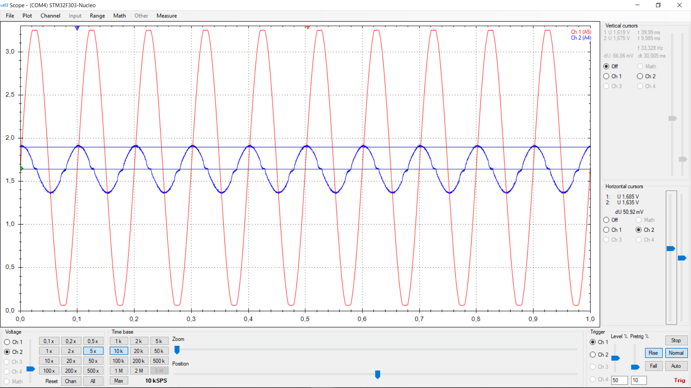

# Poznámky z pøedmìtu LPE
Usmoleno **Vojtìchem Michalem** (vojta.michall@email.cz) v prùbìhu letního semestru 2021 (B202).  
Oficiální materiály jsou na Moodle na stránce https://moodle.fel.cvut.cz/course/view.php?id=5814
a na Embedded serveru https://embedded.fel.cvut.cz/kurzy/lpe/LPE2021.

Tıdny jsou èíslovány chronologicky, poznámky k nim jsou uvedeny v obráceném poøadí.
Jako první je tedy uveden poslední tıden, scrollováním na konec stránky se èlovìk dostane na tıden první.

## Tıden 3 - Elementární tranzistorové zapojení
Insturkce pro tento tıden jsou na https://moodle.fel.cvut.cz/pluginfile.php/283739/mod_resource/content/4/LPE_3_tyden_poznamky_2021_v4.pdf

#### Úkol 3.1
> Zmìøit proudovı zesilovací èinitel NPN tranzistoru h21E

Základní zapojení se spoleènım emitorem.
Na bázi je zapojen 1 mega ohm proti 3V3, úbytek na nìm zmìøen jako 2.660 V (na PN pøechod BE zbıvá 636 mV).
V kolektoru je èervená LED a rezistor 470R s serii proti 3V3, na R úbytek 528 mV.

Z toho plyne proud bází `Ib = 2'660/1'000'000 = 2.6 uA` a proud kolektorem `Ic = 528/470 = 1.12 mA`
a zesilovací èinitel `h21E = Ib / Ic = 432`, co je oèekávatelná hodnota u signálového BJT.
Podle datasheetu jsou zesílení BJT s pøíponou "C" v rozsahu 400-800, take danı tranzistor je v garantovaném rozsahu.

S tímto zesílením lze nahradit 1M v bázi i odporem kùe - ten je ale v øádu desítek kOhm a více pouze pro nízká napìtí.
Se síovım napìtím (230 V RMS) se kùe prorazí a odpor **vıraznì poklesne**.

#### Úkol 3.2
> Rozsvítit LED pomocí NPN tranzistoru (zmìøit UBE, UCE, orientaèní vıpoèet Rb, Rc)

NPN bude pouit jako spínaè  pro seriové zapojení èervené LED a rezistoru proti 5V,
take v saturaci budu pøedpokládat nulovı úbytek napìtí mezi kolektorem a emitorem.
Pøi pouití rezistoru 470 ohm v sérii s LED s dopøednım napìtím cca 1.8V by mìl v plnì sepnutém stavu LEDkou téci proud 
`Ic = (5-1.8)/470 = 6.8mV`. Pøi proudovém zesilovacím èiniteli h21e = 432 je potøeba dodat do báze
proud alespoò `Ib = Ic/h21e = 15 uA`. Budu-li pøedpokládat, e napìovı úbytek pøechodu
BE se nebude pøíliš mìnit od úlohy 3.1, a zùstane tedy cca 650mV, poté do báze potøebuji rezistor nejvıše
`Rb_max = (3V3 - 0.65)/15uA = 176 kOhm`. Pouití napøíklad 22kOhm nám dá "šestinásobnou jistotu",
e spínání bude fungovat bez ohledu na neideality souèástek a pøípadné šumy.

Zmìøené saturaèní napìtí Uce tranzistoru v daném zapojení je 57mV, co ve srovnání s úbytkem 5V na celé vìtvi vèetnì
LED a rezistoru je skuteènì zanedbatelné. Zmìøenı úbytek na pøechodu báze-emitor je 680 mV, take odpovídá oèekávanému úbytku.

Protoe NPN tranzistor v sepnutém stavu pøizemòuje svùj kolektor, lze z nìj sestrojit nejhloupìjší invertor. Vysoká úroveò 
na bázi zpùsobí nízkou úroveò na kolektoru a naopak. Viz následující obrázek. Kanál 1 je Ube, kanál 2 je Uce.
Zajímavé je prohnutí Uce v oblasti, kde má signál na bázi maximum. Saturace BJT neprobìhne najednou,
není saturaèní napìtí není konstantní - záleí na míøe saturace.

#### Úkol 3.3
> Rozsvítit LED pomocí PNP tranzistoru (zmìøit UBE, UCE)

Princip zapojení úplnì identickı jako u NPN, jen "zrcadlovì obráceno". PNP je pøipojen emitorem na napájení,
na bázi je pøes 10k pøipojen generátor, dalších 10k je zapojeno mezi bázi a emitor jako pullup pro rychlejší zavírání.
V kolektoru je v sérii èervená LED a 470R do zemì.

Zajímavé jsou dva èasové prùbìhy se zapojení s PNP tranzistorem se sinusem a obdélníkem na vstupu.

Sinusovı vstup: kanál 1 je báze, kanál 2 je kolektor, kanál 3 je napìtí na rezistoru v kolektoru. Je vidìt, e
obvod opìt má invertující charakter, zajímavı je nábìh napìtí na rezistoru (nábìná hrana kanálu 3), kde 
se projevuje exponenciální závislost proudu bází na napìtí, je se lineární závislostí pøevádí na exp závislost proudu kolektorem
na napìtí Ueb

## Tıden 2 - RC èlánky, charakteristika LED
Instrukce pro tento tıden jsou na https://moodle.fel.cvut.cz/pluginfile.php/283737/mod_resource/content/3/LPE_2_tyden_poznamky2.pdf

  - *Dolní propust* (integraèní èlánek) je realizovatelná pomocí RC i RL. RC je typiètìjší, protoe C je typicky "ideálnìjší" ne L.
Feromagnetické jádro induktoru mùe saturovat a nejspíš bude mít hysterezi. RC taky není ideální:
pro velmi vysokou frekvenci zaène mít vliv parazitní
indukènost pøívodù a samotné ESL kondenzátoru, take impedance nebude klesat do nekoneèna.
  - *Horní propust* (derivaèní èlánek) potlaèuje DC a posiluje zmìny. Pouití pro detekci hran (strmou hranu
   derivace extrémnì zesílí) a nebo oddìlení èástí obvodu na rùznıch stejnosmìrnıch potenciálech (komunikace
BMS na jednotlivıch segmentech akumulátoru).
  - *Transient voltage suppressor* (*TVS*) - brání chvilkovım napìovım špièkám, tøeba zenerky.
  - Rezistory mají teplotní závislost, reálnì napø 50 ppm/K
  - Diody lze pouít k jednoduché stabilizaci napìtí, protoe mají malou závislost napìtí na tekoucí proudu.
  Vnitøní odpor v takovém pøípadì bude diferenciální odpor diody samotné. Zapojení dìlièe s diodou "dole" bude mít skoro
  o øád menší ztrátovı vıkon ne pouití normálního odporového dìlièe. Soubìnì bude malı pokles napìtí pod zátìí.
  V sofistikovanìjším pøípadì se pouije zenerka pro stabilizaci napìtí na dané úrovni. Pøi zatíení zdroje poklesne
  závìrné napìtí na diodì a tudí se ještì víc zmenší ztrátovı proud zpùsobenı Zenerovım prùrazem.
Ztrátovı vıkon klesá s rostoucí zátìí na zdroji.

**Monosti realizace jednoduchého zdroje** (obrázek vykradenı z pøiloeného zadání):  

(a) = odporovı dìliè (b) = dìliè s LED dole (c) = dìliè se zenerkou dole

#### Úkol 2.1
>  RC èlánek, zapojení, pozorování chování pro rùzné frekvence vstupního signálu

Zapojení osciloskopu: Kanál CH1 mìøí vstupní generovanı signál. Kanál CH2 mìøí vıstupní signál.  
Vstupní signál je generován jako sinus s amplitudou 1500 mV a offsetem 1500mV pomocí LEO.
Díky tomuto nastavení lze rozumnì od oka odeèítat pøenosy pro jednotlivé frekvence.

Zapojení je inspirované zadáním, dùleitá je úprava derivaèního èlánku, nebo ten by obecnì na vıstupu generoval záporné napìtí,
které by nebylo zdravé pro clampovací diody na pinu MCU. Rezistory R3 a R4 nastavují stejnosmìrnı pracovní bod,
vıstup tak osciluje kolem støedu napìového rozsahu <0, 3V3>.
 

##### Integraèní èlánek

Postaven s R = 10k, C = 100n, proto je èasová konstanta tau = 1ms a zlomová frekvence fk = 160 Hz.
Odeèítání èasové konstanty není v tomto pøípadì pøíliš zajímavé pro svou pøímoèarost.
Experimentálnì je provedeno a u druhé konfigurace - derivaèního èlánku.

Frekvnenèí závislost odezvy na harmonickı signál:

  - Frekvence **zlomová** (160Hz) 
    Oèekávám pokles o 3dB, take asi 70% amplitudy. Zmìøenı pokles je cca 500 mV, co jsou øádovì dvì tøetiny amplitudy.
    To je o trochu vìtší zatlumení jak 3dB, ale je stále øádovì sedí s tolerancí rezistoru a kondenzátoru.
  
  - Frekvence **o dekádu niší** (16Hz) 
    Oèekávám pokles o 0dB, protoe kondenzátor by mìl bıt rozpojením pro DC. Zmìøenı úbytek je asi 30mV
 a to je v porovnání s 1500mV amplitudy skoro nic.
  
  - Frekvence **o dekádu vyšší** (1600Hz)  
    Oèekávám pokles o 20dB, protoe jsme dekádu za zlomovkou. Útlum o 20dB znamená pøenos jen jedné desetiny amplitudy,
    co perfektnì sedí se zmìøenou amplitudou 150mV.
  

##### Derivaèní èlánek
Postaven s rezistory R2,3,4 = 10k, C = 100n, jedná se o trošku sofistikovanìjší zapojení, kde rezistory R3, R4
zajišují stejnosmìrnı pracovní bod uprostøed rozsahu napájení.  

**Analıza:** Uváíme superpozici, stejnosmìrnı zdroj korektnì nahradíme zdrojem 0V (zkrat). Tím se R3, RR4 staly paralelními.
Pro snazší odvození oznaème R = R3||R4 = 5k a pomocí nìj vyjádøíme všechny odpory v pøenosu.
Vznikl impedanèní dìliè. Mìøí se na R = R3||R4, "nahoøe" jsou v sérii kondenzátor a odpor R2 = 2R.

Po numerickém dosazení vyjde, e pøenos derivaèní sloky dosáhne jednièky pro f0 = 318 Hz,
ale díky integraèní sloce se na zlomové frekvenci f1 = 106 Hz pøenos zalomí a jde dál vodorovnì.
Pro nekoneènou frekvenci je pøenos jedna tøetina, statické zesílení 0 (DC kompletnì utlumeno).  
**Závìr**: Èasová konstanta bude ta menší z obou èasovıch konstant systému. Oèekávám tau = 1/(2\*pi\*f1) = 1.5 ms.

**Experimentální odeètení**: Pøiveïme na vstup obdélníkovı signál. Ten bude pro náš systém pøedstavovat jednotkové skoky.
Pøedpokládejme, e zvolená frekvence - v mém pøípadì 10 Hz - je dostateènì nízká, aby se èlánek zvládal ustálit.
Amplituda skokové odezvy je tìsnì pøes jeden volt, jak je vidìt na obrázku:
  
Po uplynutí jedné èasvé konstanty by mìla bıt odezva na 36% amplitudy. Pomocí kurzorù mùeme z osciloskopu odeèíst, e èasová konstanta
je pøiblinì 1.5 ms, viz následující obrázek.
  
Tento vısledek potvrzuje pøedchozí vıpoèet.
Byl ale experiment korektní? Pro odeètení amplitudy odezvy je nezbytné mít na poèátku systém ustálenı. Já pøedpokládal, e
frekvence 10 Hz je dostateèná pro ustálení odezvy. Kadou pùlperiodu vstupního signálu zapoène novı pøechodovı dìj dlouhı 50 ms.
Jestli jsme zmìøili èasovou konstantu 1.5ms, poté má systém mezi dvìma po sobì následujícími jednotkovımi skoky víc ne 33 èasovıch konstant.
Ji 4.6 tau znamená chybu menší ne jedno procento, pøi 33 tau je relativní chyba cca 4e-15. Experiment je tedy proveden korektnì, chyby zpùsobené
zanedbáváním a odhady jsou nesrovnatelnì vìtší ne chyby metodické.

**Ovìøení:**
Pro kontrolu vıše vypoètenıch frekvenèních vlastností zkusím odezvu derivaèního èlánku na harmonickı vstup.
Drme v pamìti, e amplitudová frekvenèní charakteristika má maximum pro nekoneènou frekvenci na zesílení 1/3, viz odvození pøenosu vıše.
Na vstupu èlánku je sinusovı signál s amplitudou 1500 mV, offsetem 1650 mV (støed rozsahu napájení) a promìnlivou frekvencí.
  - Frekvence skoro **nekoneèná** (50 kHz)  
    Oèekávám zeslabení signálu na jednu tøetinu a ménì. Zmìøená amplituda 449 mV øádovì sedí; H(s) = 1/3 toti platí a pro nekoneènou frekvenci a
další nezanedbatenou chybu vnáší nepøesné odeèítání hodnot. Na obrázku je 100 vzorkù z osciloskopu pracujícího na frekvenci 1MSps
kadı dílek na ose èasové tak odpovodá jedné mikrosekundì.
  
  - Frekvence **zlomová** (108Hz) 
    Amplituda je tøikrát zeslabena (|H(s)| pro s -> nekoneèno) na cca 500mV, nad to ale bude amplituda zeslabena ještì o další 3dB na 0.7*500 = 350 mV.
Zmìøené napìtí sedí velmi pøesnì.
  
  - Frekvence **o dekádu niší** (10Hz) 
  Signál je tak zatlumen, e bylo potøeba jej digitálnì zesílit na pìtinásobek, èasové prùbìhy osciloskopu tedy nejsou to scale.
Podle analızy bychom mìli mìøit 500mV zeslabenıch o 20dB (jsme dekádu od zlomovky), zmìøenıch 50 mV jsem tedy oèekával.
  

#### Úkol 2.2
> Zmìøení diferenciálního odporu LED

Na následujícím obrázku (zapùjèeném ze zadání pøiloeného vıše) je vidìt schéma zapojení a oèekávanı prùbìh
voltampérové charakteristiky na LED. Podle Shockleyovy rovnice ideální diody má závislost proudu na napìtí
v propustném smìru exponenciální charakter. Exponeniciálu zkusíme lokálnì linearizovat pomocí diferenciálních odporù
Rdiff1 na okolí proudu 3 mA a Rdiff2 na okolí proudu 20 mA.
  

**Analıza:**
Pro exponenciální závislost proudu na napìtí platí d/du exp(c\*u) = c*exp(c\*u) a analogicky pro derivace vyšších øádù.
Protoe konstantní koeficient exponenciály v rovnici diody je jistì kladnı, budou vdy voltampérová charakteristika i všechny její derivace
ryze rostoucí funkcí. Podle infinitezimální definice vodivosti a odporu:

  

a vıše zmínìné podmínky `c > 0` plyne, e diferenciální odpor bude klesat, nebo je pøevrácenou hodnotou diferenciální
vodivosti gdiff a ta jistì roste.

**Ovìøení:**
Dopøedné mìøení na LED je mìøeno pøímo kanálem `VLED`. Kanál `VR` mìøí napìtí na seriové kombinaci LED a 47ohm odporu.
Odeètením `VR - VLED` získáme diferenciální mìøení napìtí na odporu, kterı je pøímo úmìrnı tekoucímu proudu.
sloupec I se dopoète vztahem `I = (VR-VLED)/47`. Mìøení probìhlo dvakrát s dvìma rùznımi rezistory velikosti 47 ohm.

První sada mìøení:

| VR [mV] | VLED [mV] | I [mA] | Rdiff [ohm] |
|--- | ---| --- | --- | 
| 1810 | 1675 | 2.87 | 17.74 |
| 1850| 1686| 3.49 |    |
| 2862 | 1897 | 20.5 | 6.09  |
| 2983 | 1911| 22.8 |   |

Druhá sada mìøení:

| VR [mV] | VLED [mV] | I [mA] | Rdiff [ohm] |
|--- | ---| --- | --- |
| 1833 | 1667 | 3.53 |   16.18   |
| 1790 | 1656 | 2.85 |      |
| 2806 | 1831 | 20.75 |  8.35   |
| 3045 | 1867 | 25.06 |     |

**Závìr**: Diferenciální odpor LED jsou jednotky, nejvıše desítky ohmù. Mìøení je zøejmì silnì zatíeno nepøesností
rezistorù - snaíme-li se mìøit nízkı diferenciální odpor LED, hraje ohm sem èi tam u ochranného rezistoru velkou roli.
Kadopádnì se potvrdila hypotéza, e diferenciální odpor musí s rostoucím proudem klesat.
Fyzikálnì je to moné vysvìtlit vìtší saturací PN pøechodu uvnitø diody. Tím klesá odpor v *depletion layer* a
voltampérová charakteristika srtmì stoupá. Strmì tím stoupá i ztrátovı vıkon, ten byl v pøípadì maximálního mìøeného proudu
roven `25mA * 1.87V = 46.7 mW`.

**TODO**: Zeptat se na pomìr vıkonu vysvíceného a vytopeného LEDkou.

## Tıden 1 - Zapojení a základní test obvodu
Instrukce pro tento tıden jsou na https://moodle.fel.cvut.cz/pluginfile.php/283733/mod_resource/content/3/LPE_1_tyden_poznamky_2021_v2.pdf,
hlavní úkol bylo osazení breadboardu souèástkami, oivení lineárního regulátoru a MCU. Základní schéma zapojení MCU a napájení (inpirováno)
doporuèenım schématem v pøiloeném PDF. 

Následuje vlastní schéma zapojení pro zadané samostatné úlohy. Pro zjednodušení vynechávám kompletní zapojení napájení a soustøedím se jenom na signály
a pøípadnì popis, jaká periferie danı signál zpracovává. Piny jsem volil s ohledem na kompatibilitu jednotlivıch úloh, lze tedy zapojit všechny tøi úlohy najednou.

Vısledné zapojení (vidìt jsou jen úlohy 3 a 4): Úplnì vpravo je LED øízená z PWM, uprostøed jsou vidìt 3 rezistory
v dìlièi pro úlohu 1.3

#### Úkol 1.1
> Sestavení zapojení s STM32F042 na nepájivém poli

Bez poznámek
#### Úkol 1.2
>Rozblikejte LED pomocí generátoru, dvì úrovnì svitu (prùbìhy napìtí na LED zobrazit na osciloskopu a poznamenat do sešitu...)

Pøejeme si mìøit napìtí na LED, proto je nejsnazší její katodu uzemnit, abychom mohli pouít single-ended meøení místo diferenciálního.
Pøes ochranı R se na anodu pøivede PWM promìnlivé støídy. LED svítí podle stejnosmìrné støední hodnoty (tedy `3V3 * duty_cycle` generované PWM)
rozdìlené mezi LED a rezistor. Pøi dostateèné frekvenci PWM (u mne asi od 60 Hz) u nejsou vùbec vidìt probliky.  
Zkoušel jsem hledat projevy parazitní difuzní kapacity PN pøechodu uvnitø LED, ale ani s vyšší vzorkovací frekvencí nebyly hrany PWM vıraznì
deformované; zùstaly strmé a nebyla pozorovatelné exponenciála.   Záznam mìøení napìtí na diodì (je vykresleno deset period signálu):

Vısledek odpovídá døíve zmìøené hodnotì dopøedného napìtí pomocí *diode testeru* na multimetru, která byla 1620 mV.

#### Úkol 1.3
> Napište vlastní program v mbedu, rozblikat jednu extra pøipojenou LED tak, aby mìla více úrovní svítivosti, napøíklad
0-1-2-3-2-1-0... (0=nesvítí, 3=svítí nejvíce) pomocí dvou rezistorù na dvou rùznıch pinech MCU

Zapojení: anoda LED na 3V3 a "pod ni" do serie tøi rezistory 470R. Poslední rezistor je zapojen na zem. MCU mùe piny PA3, PA4 (pøipojenımi mezi kadé dva sousední 
rezistory) urèovat, jakı uzel se dostane na zemní potenciál nebo na napájení. Kdy oba piny plavou, pozoruje LED v sérii `3 * 470R`. Paklie je PA4 pøizemnìn,
pozoruje LED jen `2 * 470R` a paklie je pøizemnìn PA3, pozoruje LED v sérii jen jeden rezistor. Paklie nìjakı z pinù dává vysokou úroveò, je pøed LED nulové napìtí.  
Protoe napìtí LED v propustném smìru je na znaèném rozsahu proudù skoro konstantní (tato konkrétní LED má cca 1600 mV), dává nám zapojení monost
øídit proud LED ve ètyøech krocích. Podle `I = (3V3 - Uled)/R = cca (1V7 / R)` mohou téci proudy 0mA, 3.6mA, 1.8mA a nebo 1.2mA.

Software je triviální: V RCC zapnout hodiny pro GPIOA, dále pøepínat dva zvolené piny mezi módem `input floating` (stav po resetu)
a `push-pull general purpose output` v registrech GPIOx_MODER, GPIOx_PUPDR. V mezidobí jádro èeká v busy wait cyklu po urèitı poèet milisekund
(odmìøováno `SysTick`em).

**TODO** Setkal jsem se s podivnım chováním GPIO. Po pøepnutí pinu z GP PP vysoké úrovnì do input floating (MODER = 0, PUPDR = 0) byla na vıstupu stále jednièka,
aèkoli by mìl plavat. Fixnulo se to clearnutím pøíslušného bitu v ODR, poté zaèal pin plavat. Jednalo se o PA3 (pin 9), zeptat se na cviku.

#### Úkol 1.4
> Napište vlastní program v mbedu, kterı bude plynule rozsvìcet a zhasínat LED (buï pomocí wait a cyklù nebo pwm a zmìny støídy)

Pøíhodnı se ukázal timer 14 generující PWM s promìnlivou støídou na pinu PA7. Mikrokontroler bìí z 8MHz HSI násobeného šestkrát interní PLL.
Prozatím nechme i PCLK na 48MHz. Timer 14 je širokı 16 bitù. Pøi pouití prescaleru 48 - 1 bude na vstupu timeru frekvence 1 MHz.
Nastavením TIMx_ARR = 1000 dostaneme PWM na frekvenci 1kHz se støídou nastavovatelnou po promile zápisem do TIMx_CCR1.
Pro plynulejší pøechody se zápisy do TIMx_CCR1 provádí v SysTick interruptu bìícího na 1 kHz, zapise je v reimu napodobujícícm
center-aligned mód timeru. Jas LED tedy plynule nabíhá od nuly do 100% a následnì klesá v nule.

**TODO** Zeptat se, proè mohly plovoucí piny 17,18 (D+, D-) zpùsobit nestabilní koumikaci STlinku s mikrokontrolerem. Staèilo se prstem dotknout
odhalenıch pinù MCU a ji to vedlo na stabilní komunikaci.
